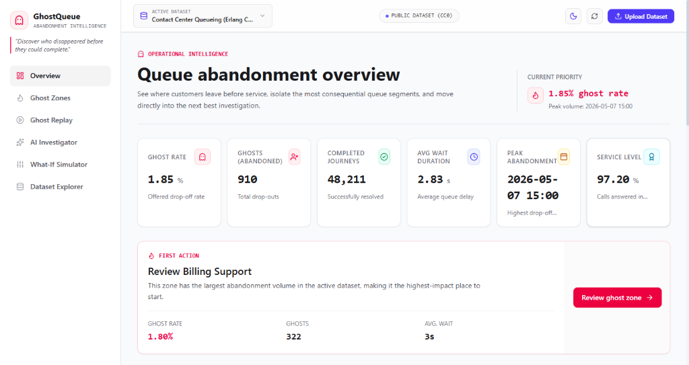
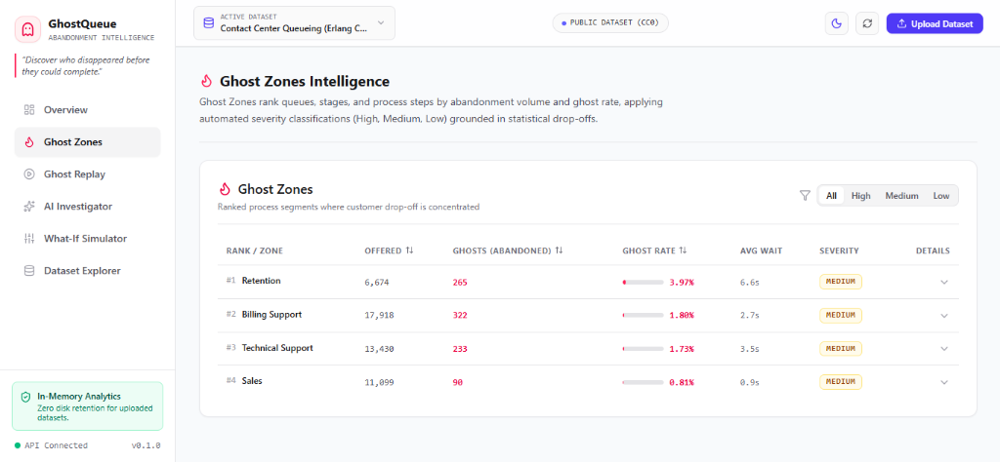
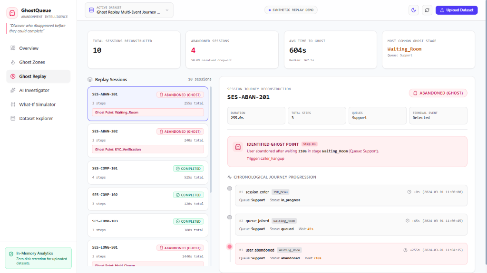
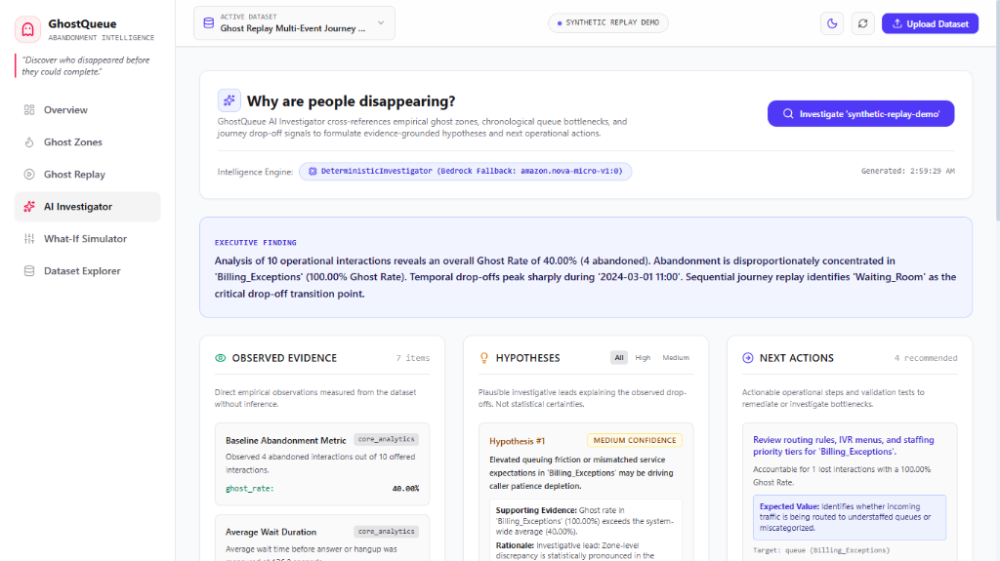
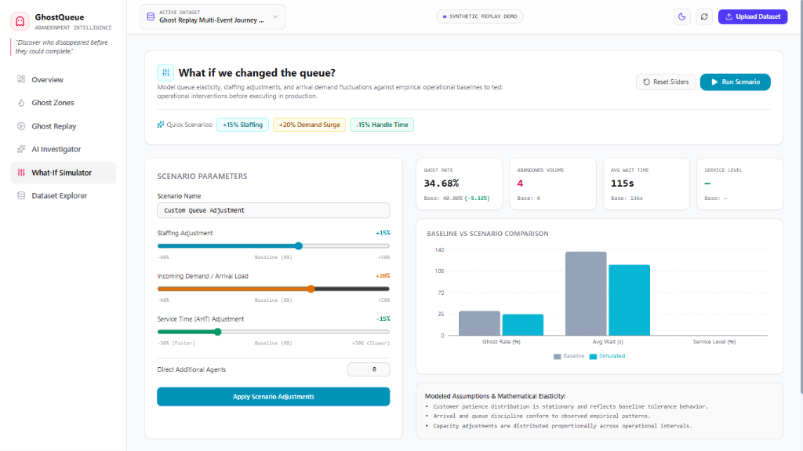

# GhostQueue 👻

> **Human Process Abandonment Intelligence**  
> *Find where people disappear. Understand why. Test what could change.*

[](https://drive.google.com/file/d/1YXwpFSI3xwr1x3jutgWcElojKXQExDut/view?usp=sharing)
[](https://44.212.26.59.sslip.io/)
[](https://44.212.26.59.sslip.io/)
[-000000?logo=next.js&logoColor=white)](https://nextjs.org/)
[](https://fastapi.tiangolo.com/)
[](https://www.python.org/)
[](tests/)
[](LICENSE)

---

## 🎬 Product Demo Video

🎥 **Watch the Full Video Walkthrough**: **[GhostQueue Project Demo (Google Drive)](https://drive.google.com/file/d/1YXwpFSI3xwr1x3jutgWcElojKXQExDut/view?usp=sharing)**

A 3-minute video presentation covering:
- **Project Overview**: Uncovering hidden queue abandonment across contact centers and operational journeys.
- **Interactive UI Tour**: Executive KPIs, Ghost Zones severity ranking, Ghost Replay journey reconstruction, and What-If capacity simulation.
- **Hybrid AI Architecture**: Amazon Bedrock integration using secretless IAM instance roles with automatic deterministic fallback.
- **AWS Infrastructure**: Production deployment on Amazon EC2 with Let's Encrypt TLS 1.3 encryption.

---

## 🌐 Live Public Deployment (HTTPS Enabled)

GhostQueue is deployed on AWS with **end-to-end SSL/TLS encryption (HTTPS)** and automatic HTTP-to-HTTPS redirection:

| Service | Secure HTTPS URL | Description |
| :--- | :--- | :--- |
| **Demo Video** | **[Watch Demo Video](https://drive.google.com/file/d/1YXwpFSI3xwr1x3jutgWcElojKXQExDut/view?usp=sharing)** | 3-minute video walkthrough covering architecture and live UI |
| **Frontend Application** | **[https://44.212.26.59.sslip.io/](https://44.212.26.59.sslip.io/)** | Production Next.js 16 web dashboard with Light/Dark theming |
| **API Health Check** | **[https://44.212.26.59.sslip.io/health](https://44.212.26.59.sslip.io/health)** | Live FastAPI service health & runtime status |
| **Interactive API Docs** | **[https://44.212.26.59.sslip.io/docs](https://44.212.26.59.sslip.io/docs)** | Swagger UI for executing and testing API endpoints |
| **Alternative Secure URL** | **[https://44.212.26.59.nip.io/](https://44.212.26.59.nip.io/)** | Secondary trusted TLS domain alias |
| **HTTP Auto-Redirect** | `http://44.212.26.59/` | Permanent 301 redirect to secure HTTPS |

---

## ☁️ AWS Deployment Architecture

The application is deployed on AWS with genuine, production-grade infrastructure:

```
                          [ Public Internet / User ]
                                      │
                         HTTPS (Port 443) / HTTP (Port 80)
                                      │
                                      ▼
                        AWS EC2 (Ubuntu 24.04 LTS)
                        [ Security Group: ports 443, 80 ]
                                      │
                                      ▼
                         Nginx Reverse Proxy & SSL
                    (Let's Encrypt TLS 1.3 Termination)
                   (Auto 301 Redirect from HTTP to HTTPS)
                     ┌────────────────┴────────────────┐
                     │                                 │
              location /                        location /api/
                     │                          location /health
                     ▼                          location /docs
            Next.js 16 Web App                         │
               (Port 3000)                             ▼
          Managed by systemd                  FastAPI Backend Service
                                                    (Port 8000)
                                                Managed by systemd
                                                       │
                                                       ▼
                                                AWS IAM Role
                                         (ghostqueue-ec2-profile)
                                                        │
                                                        ▼
                                             Amazon Bedrock API
                                       (Amazon Nova / Claude / Titan)
```

- **Amazon EC2**: High-performance compute (`t3.small`) hosting both the Node.js frontend and Python FastAPI backend under systemd supervision.
- **SSL/TLS Encryption**: Verified TLS 1.3 certificates via Let's Encrypt with automated certbot renewals and strict HTTP-to-HTTPS redirection.
- **Nginx Reverse Proxy**: Eliminates cross-origin CORS overhead by serving web assets and proxying `/api/` over HTTPS.
- **AWS IAM & Amazon Bedrock**: Configured with `AmazonBedrockFullAccess` and IAM instance profile (`ghostqueue-ec2-profile`) for secretless foundation model inference.
- **Zero Localhost Leaks**: Production build strictly relies on dynamic same-origin API calls over secure HTTPS.

---

## 📸 Application Screenshots

### 1. Queue Abandonment Overview

*High-level executive dashboard tracking system-wide ghost rates, offered volume, average wait duration, and priority triage actions.*

---

### 2. Ghost Zones Intelligence

*Ranked table of operational queues and service stages classified by drop-out volume, wait time, and automated statistical severity tiers.*

---

### 3. Ghost Replay & Session Reconstruction

*Chronological step-by-step reconstruction of individual customer journeys identifying the exact transition point where abandonment occurred.*

---

### 4. AI Root-Cause Investigator

*Hybrid root-cause intelligence engine synthesizing empirical queue metrics into confidence-scored hypotheses and prioritized operational next steps.*

---

### 5. What-If Scenario Simulator

*Interactive Erlang-C capacity and elasticity simulator modeling the impact of staffing adjustments, arrival surges, and handling times on ghost rates.*

---

## 🌟 Key Capabilities

### 1. 📊 Executive Abandonment Overview & KPI Engine
- **Ghost Rate Tracking**: Quantifies the percentage and headcount of customers who abandon queues before receiving service.
- **Action-Led Triage**: Highlights the highest-abandonment zone and peak volume hour to direct operational attention immediately.
- **Visual Intelligence**: Interactive Recharts donut drop-off distributions and chronological interval trends.

### 2. 🔥 Ghost Zones
- **Ranked Impact**: Ranks queues, stages, and customer service tiers by drop-out count.
- **Automated Severity Classification**: Assigns statistical severity tiers (**High**, **Medium**, **Low**) based on comparative abandonment thresholds and wait times.
- **Detailed Metrics Drawer**: Inspect offered load, answered volume, average queue delay, and historical drop-off ratios per zone.

### 3. ⏪ Ghost Replay
- **Chronological Journey Reconstruction**: Step-by-step reconstruction of individual customer session journeys.
- **Ghost Point Callout**: Pins the exact timestamp, elapsed dwell time, and stage where a user abandoned vs. completed service.
- **Unresolved Session Reconstruction**: Isolates drop-out interactions for granular root-cause inspection.

### 4. 🧠 AI Investigator (Root-Cause Engine)
- **Hybrid Diagnostic Architecture**: GhostQueue integrates Amazon Bedrock (Amazon Nova Micro) as the LLM-powered AI Investigator, paired with an automatic deterministic evidence-based fallback when Bedrock is unavailable or model access is pending authorization.
- **Zero Secret Keys Required**: Authenticates automatically via EC2 IAM Instance Profile (`ghostqueue-ec2-profile`) using short-lived tokens—zero hardcoded credentials or `.env` secrets.
- **Strict Privacy Boundary**: Transmits strictly derived mathematical aggregates and summary distributions to Amazon Bedrock; zero raw dataset rows, customer records, or PII are ever sent.
- **Graceful Deterministic Fallback**: When Bedrock invocation returns an authorization error or is unreachable, the system automatically falls back to the deterministic engine without interrupting runtime operations, surfacing the fallback reason transparently in the audit trail.
- **Structured Output**: Generates executive finding summaries, empirical observations, confidence-scored hypotheses (High/Medium/Low), and prioritized next operational actions.
- **Grounded Evidence**: Directly links hypotheses back to empirical metrics (e.g., specific wait thresholds, peak periods).

### 5. 🎛️ What-If Scenario Simulator
- **Interactive Elasticity Modeling**: Adjust staffing levels (agent headcount), customer arrival demand (%), and handling times (%).
- **Calibrated Mathematical Projections**: Evaluates non-linear queue elasticity ($W_{\text{sim}} = W_0 \times L^{1.4}$, $G_{\text{sim}} = G_0 \times (W_{\text{sim}}/W_0)^{0.85}$).
- **Before-and-After Comparisons**: Direct comparative charts showing simulated ghost rates, projected drop-outs, and service level impacts against baselines.
- **Explicit Assumptions Notice**: Transparently distinguishes mathematical scenario modeling from empirical predictions.

### 6. 📁 Dataset Registry & Provenance Catalog
- **Strict Provenance Standards**: Categorizes datasets across three integrity tiers:
  1. **Public Domain Benchmark**: Real CC0 Contact Center Queueing (Erlang C) dataset with 2,400 half-hour intervals (49,121 offered, 48,211 answered, 910 abandoned, 1.85% ghost rate).
  2. **Research-Schema Fixture**: Published Emory Healthcare outpatient contact center schema fixture (JMIR 2026).
  3. **Synthetic Replay Demo**: High-fidelity multi-step event journeys with granular session event streams.
- **Dynamic Capability Detection**: Automatically activates or hides dashboard workspaces based on detected schema fields.

### 7. 🔒 Pure In-Memory Custom Dataset Ingestion
- **Privacy First**: User-uploaded CSV and JSON datasets are parsed, profiled, and analyzed entirely in volatile RAM.
- **Zero Disk Persistence**: Raw custom uploads are never written to databases or disk.
- **PII Advisory Scanning**: Inspects incoming column headers for personally identifiable information (SSN, credit cards, emails, phone numbers).

### 8. ☀️ Light Mode Default & 🌙 Dark Mode Switcher
- **Light Mode Default**: Crisp, high-contrast light theme loaded by default with zero hydration flash.
- **Instant Toggle**: Sun / Moon switcher in the top navigation bar with persistent storage in `localStorage`.
- **Full Design System Coverage**: Tailored Tailwind CSS v4 design system across all cards, charts, modals, drawers, and tables.

---

## 🛠️ Architecture & Tech Stack

```
ghostqueue/
├── backend/                  # FastAPI Application
│   ├── app/
│   │   ├── ai/               # Deterministic investigator & Bedrock provider
│   │   ├── analytics/        # Ghost rates, ghost zones, & time-series analysis
│   │   ├── core/             # Provenance, privacy boundaries, & configuration
│   │   ├── ingestion/        # In-memory CSV/JSON parsers & schema profiler
│   │   ├── models/           # Pydantic schemas & response models
│   │   ├── simulation/       # What-if queue elasticity engine
│   │   └── main.py           # FastAPI entrypoint & REST API endpoints
├── frontend/                 # Next.js 16 Web Application
│   ├── app/                  # App Router, layout, & globals.css (Tailwind v4)
│   ├── components/           # AppShell, Charts, Tables, Simulator, Investigator, Replay
│   ├── lib/                  # API client bindings
│   └── types/                # TypeScript interface definitions
├── tests/                    # Pytest test suite (77 passing tests)
└── docs/                     # Technical architecture documentation
```

### Technology Highlights
- **Frontend**: Next.js 16 (Turbopack), React 19, TypeScript, Tailwind CSS v4 (`@tailwindcss/postcss`), Recharts, Lucide Icons.
- **Backend**: Python 3.11+, FastAPI, Pandas, NumPy, Pydantic v2, Uvicorn.
- **Cloud & Infrastructure**: AWS EC2, Ubuntu 24.04, Nginx, AWS IAM, Amazon Bedrock, AWS CLI v2.
- **Testing & Quality**: Pytest, AsyncIO, Pyright (0 errors / 0 warnings).

---

## 🚀 Running Locally

### Prerequisites
- Python 3.11 or higher
- Node.js 18 or higher (with `npm`)

### 1. Clone the Repository
```bash
git clone https://github.com/ayus1234/ghostqueue.git
cd ghostqueue
```

### 2. Start the Backend
```bash
# Optional: create a virtual environment
python -m venv venv
# Windows:
venv\Scripts\activate
# macOS/Linux:
source venv/bin/activate

# Install dependencies
pip install -r backend/requirements.txt

# Run FastAPI server
uvicorn app.main:app --app-dir backend --host 127.0.0.1 --port 8000 --reload
```
API is available at [http://127.0.0.1:8000](http://127.0.0.1:8000)  
Interactive Swagger documentation: [http://127.0.0.1:8000/docs](http://127.0.0.1:8000/docs)

### 3. Start the Frontend
```bash
cd frontend

# Install dependencies
npm install

# Start Next.js dev server
npm run dev
```
Open [http://localhost:3000](http://localhost:3000) in your browser.

---

## 🧪 Testing

Run the full backend test suite:
```bash
python -m pytest
```
*Current status: 77 tests passing across analytics, ingestion, simulation, investigator, privacy, and registry validation.*

Validate frontend build:
```bash
cd frontend
npm run build
```
*Current status: 0 TypeScript or linting errors.*

---

## 🔐 Privacy & Governance Policy
- **No Data Retention on Uploads**: Uploaded operational datasets are evaluated strictly in RAM.
- **Deterministic AI Baseline**: Intelligence generation operates reliably without mandatory third-party AI keys or external data transmission.
- **Strict Provenance Integrity**: Public datasets, research fixtures, and synthetic journeys are never conflated.

---

## 📄 License
This project is licensed under the Apache 2.0 License — see the [LICENSE](LICENSE) file for details.  
The embedded Contact Center Erlang dataset is dedicated to the public domain under Creative Commons CC0.
